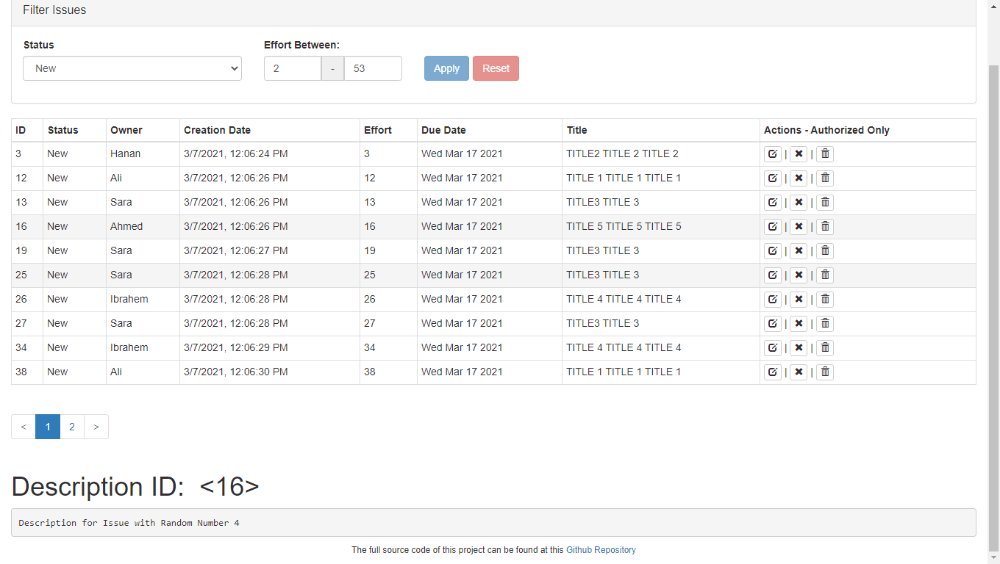
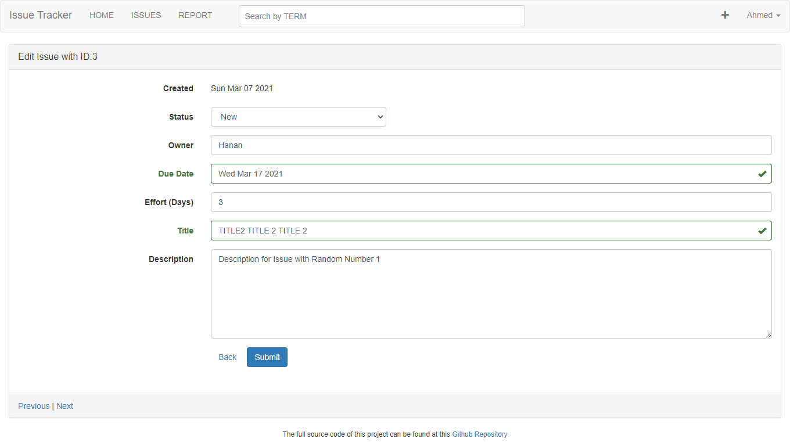
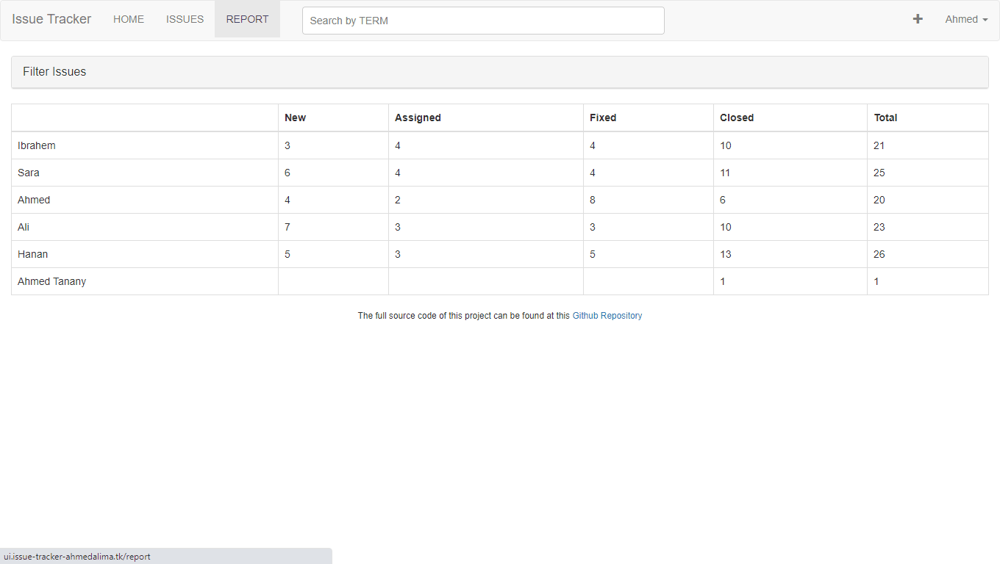
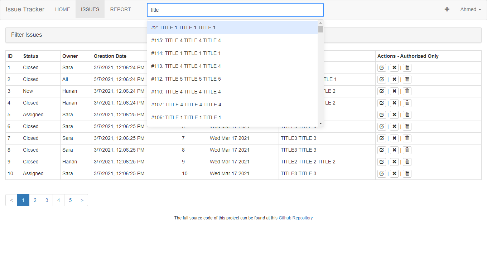

<h1> Issue Tracker Application </h1>

| A fully responsive `Single Page Application` for tracking issues

http://ui.issue-tracker-ahmedalima.tk/issues

This repository contains the Back-End application.
UI application is <a href="https://github.com/ahmedalima/tracker-ui" target="_blank" rel="noreferrer"> HERE </a>

Live Demo:&nbsp; 
<a href="http://ui.issue-tracker-ahmedalima.tk/issues" target="blank" rel="noreferrer" >
 Issue Tracker 
</a>



<h2>
Technology Stack (MERN Stack)
</h2>

* `MongoDB`: NoSQL Database. 

* `Atlas`: for cloud database hosting.

* `ExpressJS`: for configuring API and UI servers.

* `React`: Front-end and UI

* `Bootstrap`: for styling.

* `NodeJS`: Back-end server

<br />

<h2>
Features
</h2>

* `Server-Side-Render(SSR)`.
  * full rendering with credentials. 


* `Adding a New Issue.` 


<br />

<br />


* `Editing Existing Issue.` - Requires authentication (Sign In).



<br />

<br />

* `Report Page`: List all Owners and number of Issue Types associated with them.



<br />

<br />


* `Deleting Issue` - Requires authentication (Sign In).

* `Close Issue` - Requires authentication (Sign In).

* `Filter Issues`.

* `Sign In` - Google OAuth2 Sign In


<br />
<br />

* Persistent Sign in on browser refreshing during session.
<br />

* Search the `title` and `description` fields.



* User credentials are saved in Javascript Web Token &nbsp; `JWT`

* `Session Cookies` are used in storing and transferring JWT.


<br />
<br />


<h2>
Each Issue has the following properties:
</h2>

* `ID` => Unique Identification Number (Auto-Generated). Immutable.

* `Status` => (New, Assigned, Fixed, Closed) indicate current state of issue. Mutable

* `Owner` => Name of the issue owner. Mutable

* `Created` => Date Of creation - Auto-Generated - Immutable.

* `Effort` => Estimated number of days for finishing up the issue. Mutable

* `Due` => Date expected to finish up the issue. Mutable

* `Title` => The Issue's title. Mutable

* `Description` => Detailed Description of the Issue

<br />

<br />


<h3> To run locally: </h3>

* `Run the API Application`
  * API application Repository
    * https://github.com/ahmedalima/tracker-api

* `npm install`
  * To install Application Dependencies. First time only.

* `npm run server-with-HMR`
  * Compile (Babel) and bundle Server code using Webpack.

* Set environment variables. Either by creating "sample.env" file or defining them in you shell
  * Required Environment variables are listed below.

* `npm start`
  * Start the UI server.
  * Ui Server code runs "Webpack Dev and Hot Module Replacement" middleware for transforming and bundling UI code. 

<br />
<h2>
Required Environment variables
</h2>

<br />

```

# server port
# during deployment and runtime, it is set automatically
#   and overwrites what is implemented here
PORT=8000

# HMR of Webpack, enable it during development
ENABLE_HMR=true

# Google OAuth2 Client Credentials ID 
GOOGLE_CLIENT_ID=-you-Google cLient Id-.apps.googleusercontent.com


# REGULAR MODE API ENDPOINTS
# API url for client
# UI_API_ENDPOINT=http://localhost:3000/graphql

# # API URL for ui server, it doesn't affected by CORS policies
# UI_SERVER_API_ENDPOINT=http://localhost:3000/graphql

# # auth api endpoint
# UI_AUTH_ENDPOINT=http://localhost:3000/auth

#  REGULAR CONFIGURATION WITH DOMAINS
UI_API_ENDPOINT=http://api.promernstack.com:3000/graphql
UI_SERVER_API_ENDPOINT=http://api.promernstack.com:3000/graphql
UI_AUTH_ENDPOINT=http://api.promernstack.com:3000/auth

# PROXY MODE API ENDPOINTS

# UI_API_ENDPOINT=http://localhost:8000/graphql

# UI_API_ENDPOINT=/graphql

# UI_AUTH_ENDPOINT=/auth

# API_PROXY_TARGET=http://localhost:3000

# UI_SERVER_API_ENDPOINT=http://localhost:3000/graphql
```
